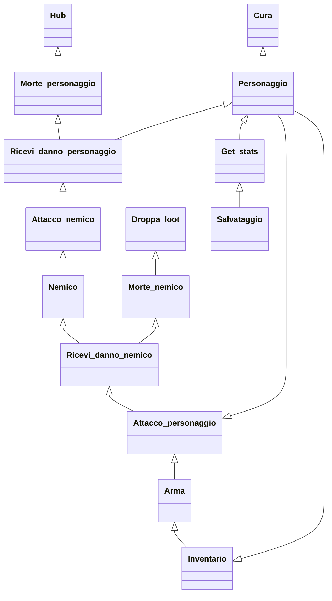

# Caso d'uso combattimento

```mermaid
classDiagram
Personaggio <|-- Ricevi_danno_personaggio
Ricevi_danno_personaggio <|-- Attacco_nemico
Attacco_nemico <|-- Nemico
Nemico <|-- Ricevi_danno_nemico
Ricevi_danno_nemico <|-- Attacco_personaggio
Attacco_personaggio <|-- Personaggio
Morte_nemico <|-- Ricevi_danno_nemico
Droppa_loot <|-- Morte_nemico
Inventario <|-- Personaggio
Arma <|-- Inventario
Attacco_personaggio <|-- Arma
Cura <|-- Personaggio
Hub <|-- Morte_personaggio
Morte_personaggio <|-- Ricevi_danno_personaggio
Get_stats <|-- Salvataggio
Personaggio <|-- Get_stats
```