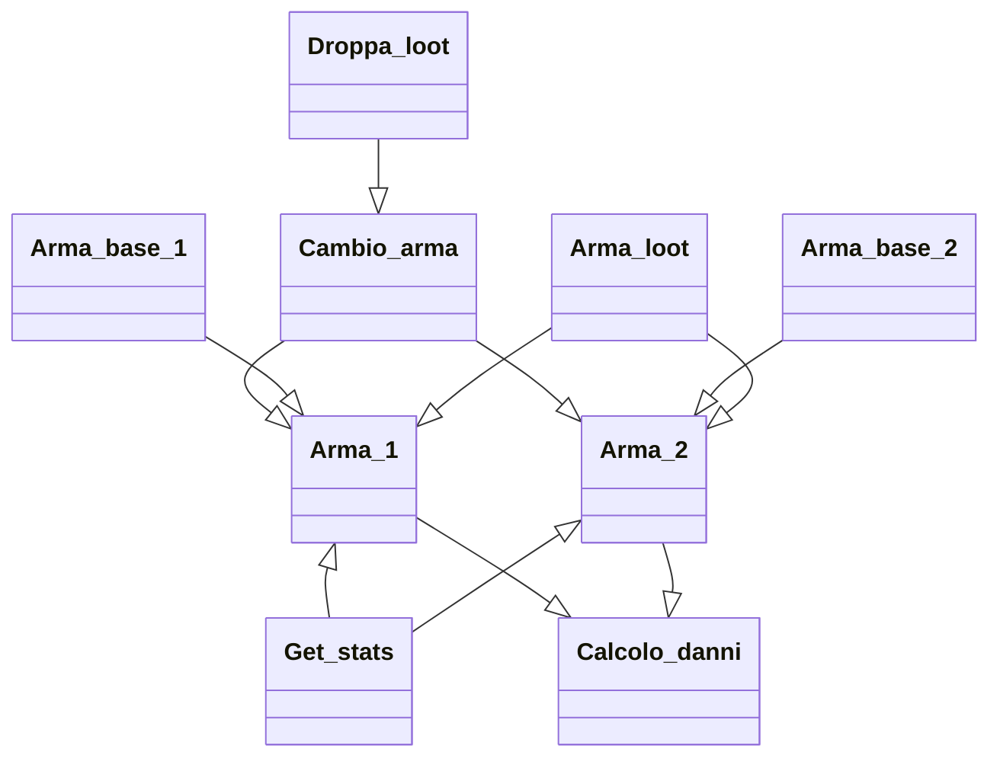

# Casi d'uso inventario

```mermaid
classDiagram
Arma_1 <|-- Get_stats
Arma_2 <|-- Get_stats
Cambio_arma --|> Arma_1
Cambio_arma --|> Arma_2
Arma_base_1 --|> Arma_1
Arma_base_2 --|> Arma_2
Arma_loot --|> Arma_1
Arma_loot --|> Arma_2
Droppa_loot --|> Cambio_arma
Arma_1 --|> Calcolo_danni
Arma_2 --|> Calcolo_danni
```